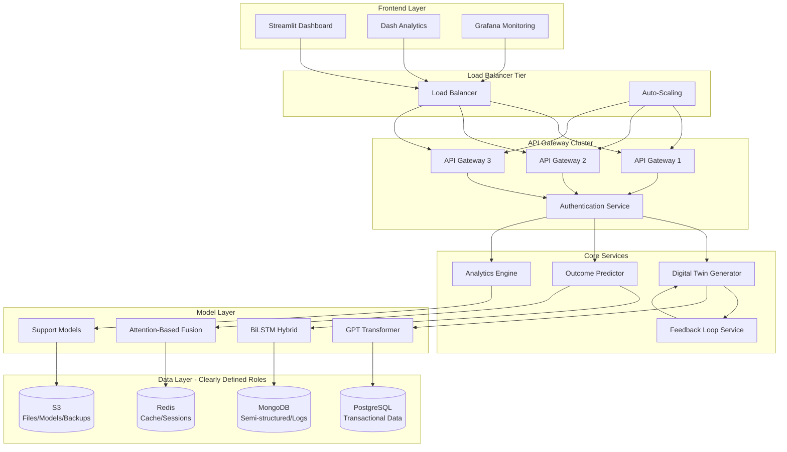
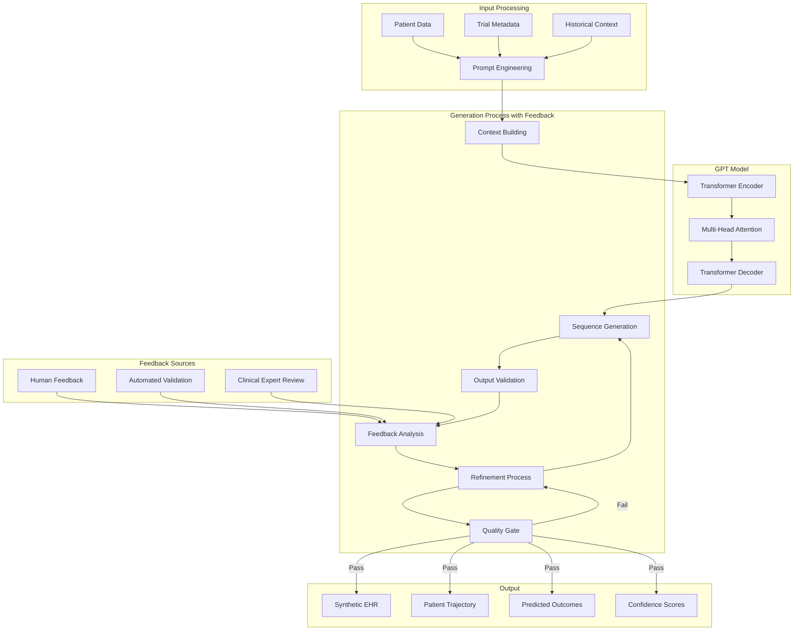
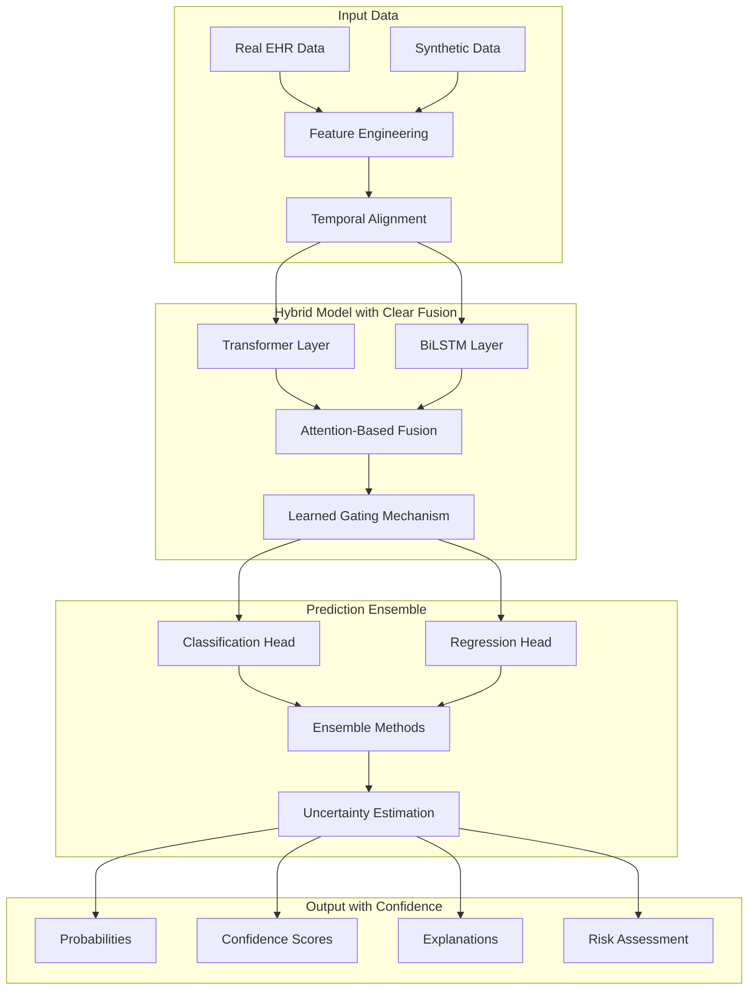
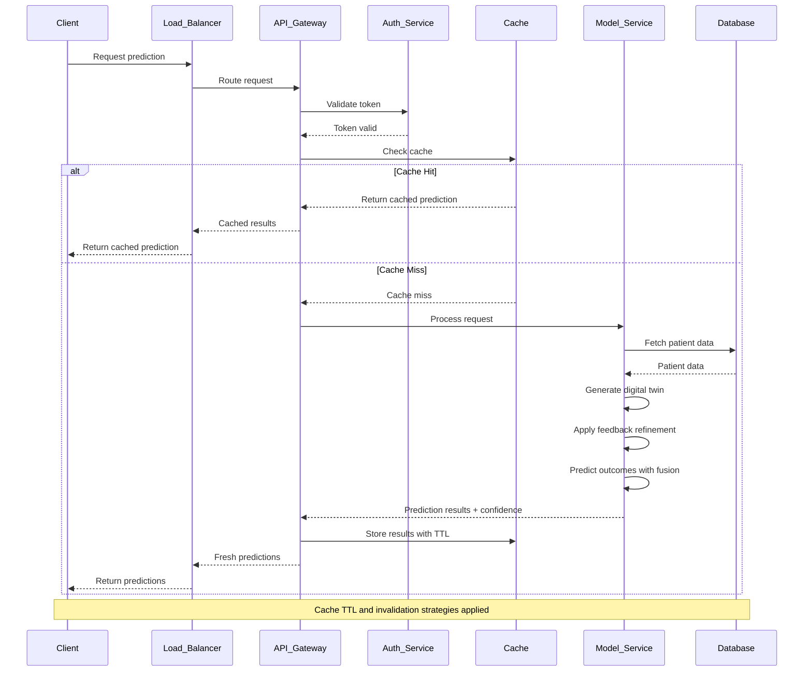
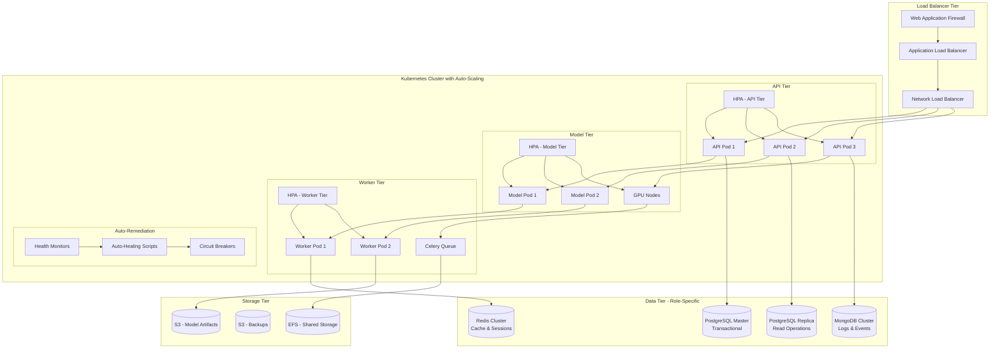
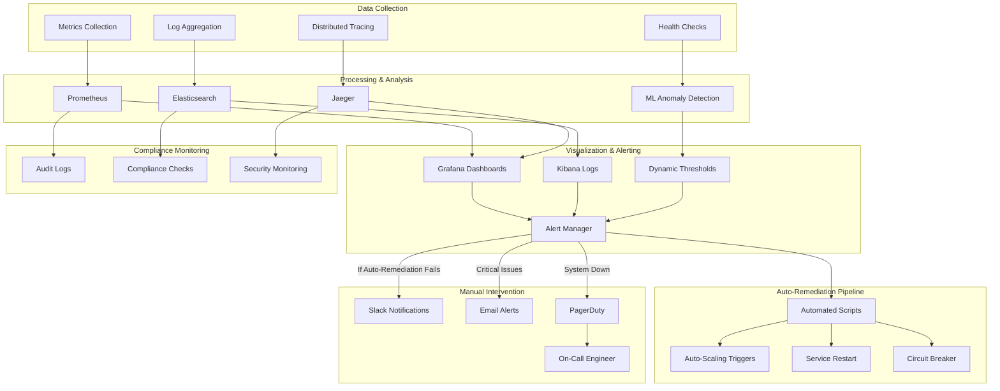
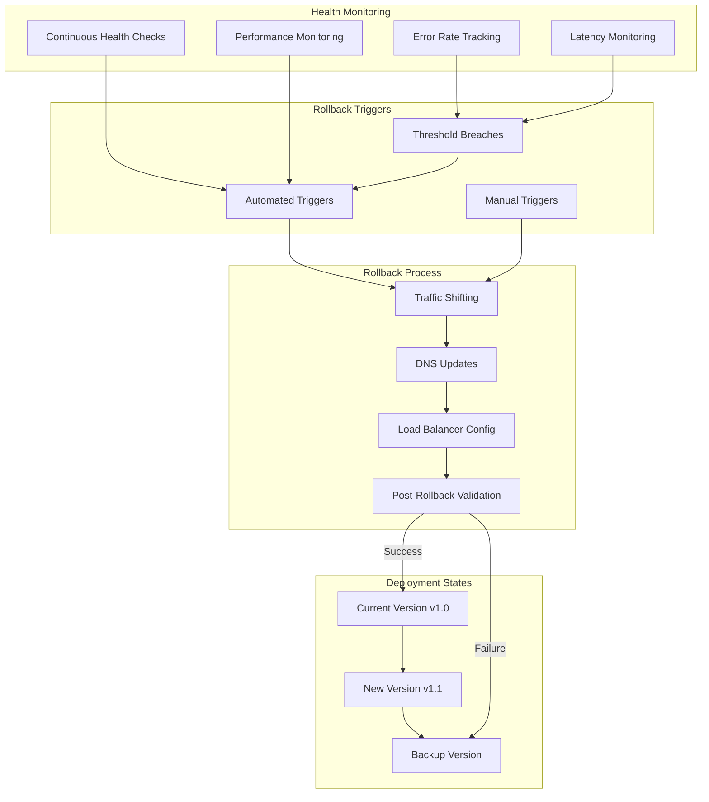
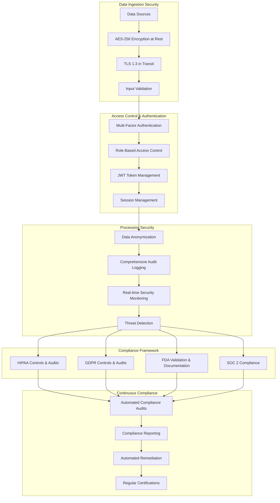

# EvoClone
EvoClone is an AI-based digital twin platform that creates personalized virtual replicas of patients using clinical, genetic, and physiological data. These twins are used to simulate drug responses in silico, enabling safer and more efficient decision-making throughout the clinical trial process.​​

## High Level Model Architecture

### 1. Improved High-Level System Architecture

### 2. Enhanced Digital Twin Generation with Feedback Loop

### 3. Enhanced Outcome Prediction with Attention-Based Fusion

### 4. Optimized Real-time Inference Flow with Cache Handling

### 5. Enhanced Deployment Architecture with Auto-Scaling

### 6. Enhanced Monitoring & Alerting with Auto-Remediation

### 7. Enhanced CI/CD Pipeline with Comprehensive Testing

```mermaid
flowchart LR
    subgraph "Source Control"
        GIT[Git Repository]
        PR[Pull Request]
        CODE_REVIEW[Code Review]
        MERGE[Merge to Main]
    end
    
    subgraph "Build & Test"
        BUILD[Build Image]
        UNIT[Unit Tests]
        INTEGRATION[Integration Tests]
        SECURITY_SCAN[Security Scan]
        PERFORMANCE[Performance Tests]
        PUSH[Push to Registry]
    end
    
    subgraph "Staging Deployment"
        STAGING[Deploy to Staging]
        E2E[End-to-End Tests]
        LOAD[Load Testing]
        COMPLIANCE[Compliance Validation]
        APPROVE[Manual Approval]
    end
    
    subgraph "Production Deployment"
        BLUE_GREEN[Blue-Green Deploy]
        CANARY[Canary Release]
        HEALTH_PROD[Health Checks]
        ROLLBACK_READY[Rollback Ready]
    end
    
    subgraph "Post-Deploy Monitoring"
        MONITOR[Performance Monitor]
        ALERT_CHECK[Alert Validation]
        SUCCESS[Deployment Success]
        AUTO_ROLLBACK[Auto Rollback]
    end
    
    GIT --> PR
    PR --> CODE_REVIEW
    CODE_REVIEW --> MERGE
    MERGE --> BUILD
    
    BUILD --> UNIT
    UNIT --> INTEGRATION
    INTEGRATION --> SECURITY_SCAN
    SECURITY_SCAN --> PERFORMANCE
    PERFORMANCE --> PUSH
    
    PUSH --> STAGING
    STAGING --> E2E
    E2E --> LOAD
    LOAD --> COMPLIANCE
    COMPLIANCE --> APPROVE
    
    APPROVE --> BLUE_GREEN
    BLUE_GREEN --> CANARY
    CANARY --> HEALTH_PROD
    HEALTH_PROD --> ROLLBACK_READY
    
    ROLLBACK_READY --> MONITOR
    MONITOR --> ALERT_CHECK
    ALERT_CHECK --> SUCCESS
    ALERT_CHECK -->|Failure| AUTO_ROLLBACK
    AUTO_ROLLBACK --> ROLLBACK_READY
```

### 8. Zero-Downtime Rollback Strategy

### 9. Comprehensive Security & Compliance Flow

### 10. Model Training Workflow with Continuous Learning

```mermaid
graph TD
    subgraph "Data Preparation"
        RAW[Raw Data]
        QUALITY[Data Quality Checks]
        PREPROCESS[Preprocessing]
        AUGMENT[Data Augmentation]
        VALIDATE[Validation Split]
    end
    
    subgraph "Model Development"
        ARCH[Architecture Design]
        INIT[Model Initialization]
        PRETRAIN[Pre-training]
        FINETUNE[Fine-tuning]
        ENSEMBLE[Ensemble Methods]
    end
    
    subgraph "Training Process"
        TRAIN[Training Loop]
        EVAL[Real-time Evaluation]
        HYPERPARAM[Bayesian Optimization]
        CHECKPOINT[Smart Checkpointing]
        EARLY_STOP[Early Stopping]
    end
    
    subgraph "Model Validation"
        TEST[Comprehensive Testing]
        METRICS[Multi-Metric Evaluation]
        COMPARE[A/B Testing]
        SELECT[Model Selection]
        EXPLAINABILITY[Model Explainability]
    end
    
    subgraph "Continuous Learning"
        FEEDBACK_LOOP[Feedback Integration]
        ONLINE_LEARNING[Online Learning]
        DRIFT_DETECTION[Model Drift Detection]
        AUTO_RETRAIN[Automated Retraining]
    end
    
    subgraph "Deployment Pipeline"
        PACKAGE[Model Packaging]
        STAGING_DEPLOY[Staging Deployment]
        PROD_DEPLOY[Production Deployment]
        MONITOR_PERF[Performance Monitoring]
        VERSION_CONTROL[Model Versioning]
    end
    
    RAW --> QUALITY
    QUALITY --> PREPROCESS
    PREPROCESS --> AUGMENT
    AUGMENT --> VALIDATE
    
    VALIDATE --> ARCH
    ARCH --> INIT
    INIT --> PRETRAIN
    PRETRAIN --> FINETUNE
    FINETUNE --> ENSEMBLE
    
    ENSEMBLE --> TRAIN
    TRAIN --> EVAL
    EVAL --> HYPERPARAM
    HYPERPARAM --> CHECKPOINT
    CHECKPOINT --> EARLY_STOP
    
    EARLY_STOP --> TEST
    TEST --> METRICS
    METRICS --> COMPARE
    COMPARE --> SELECT
    SELECT --> EXPLAINABILITY
    
    EXPLAINABILITY --> FEEDBACK_LOOP
    FEEDBACK_LOOP --> ONLINE_LEARNING
    ONLINE_LEARNING --> DRIFT_DETECTION
    DRIFT_DETECTION --> AUTO_RETRAIN
    
    AUTO_RETRAIN --> PACKAGE
    PACKAGE --> STAGING_DEPLOY
    STAGING_DEPLOY --> PROD_DEPLOY
    PROD_DEPLOY --> MONITOR_PERF
    MONITOR_PERF --> VERSION_CONTROL
    
    VERSION_CONTROL --> DRIFT_DETECTION
    MONITOR_PERF --> FEEDBACK_LOOP
```

